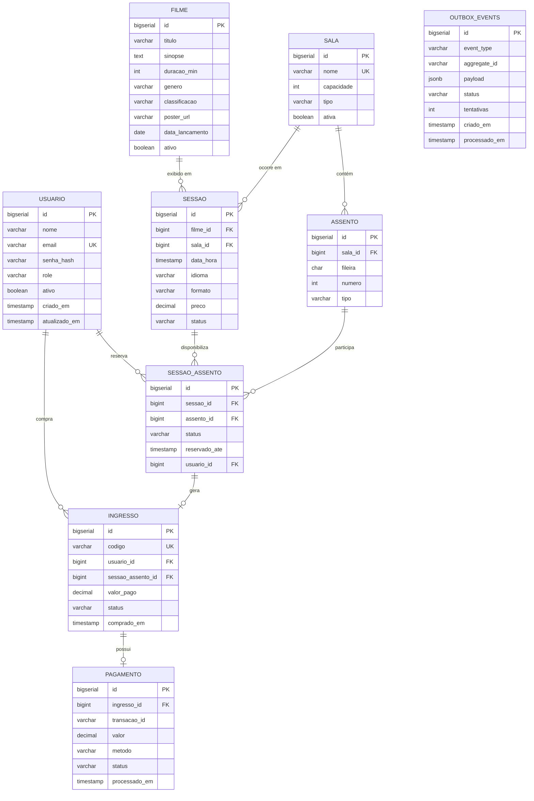

# Banco de Dados — ERD

## Diagrama Entidade-Relacionamento

---

## Relacionamentos — resumo

| Tabela A | Tabela B | Tipo | Chave |
|---|---|---|---|
| `usuario` | `ingresso` | 1:N | `ingresso.usuario_id` |
| `usuario` | `sessao_assento` | 1:N | `sessao_assento.usuario_id` (nullable) |
| `filme` | `sessao` | 1:N | `sessao.filme_id` |
| `sala` | `sessao` | 1:N | `sessao.sala_id` |
| `sala` | `assento` | 1:N | `assento.sala_id` |
| `sessao` | `sessao_assento` | 1:N | `sessao_assento.sessao_id` |
| `assento` | `sessao_assento` | 1:N | `sessao_assento.assento_id` |
| `sessao_assento` | `ingresso` | 1:0..1 | `ingresso.sessao_assento_id` |
| `ingresso` | `pagamento` | 1:0..1 | `pagamento.ingresso_id` |
| `outbox_events` | (independente) | — | `aggregate_id` referencia ID de outras tabelas por convenção |

---

## Notas de design

- `sessao_assento` é a tabela de junção N:N entre `sessao` e `assento`,
  mas com **estado** (status, reservado_ate, usuario_id). Não é uma simples tabela de pivot.
- `outbox_events` é desacoplada — não tem FK para `ingresso`.
  O `aggregate_id` é uma String (ex: "42") que referencia o ID do agregado por convenção de aplicação.
  Isso permite usar o Outbox com qualquer tipo de agregado sem alterar o schema.
- `reservado_ate` em `sessao_assento` é o TTL da reserva temporária.
  O controle de expiração real é feito no Redis (`reserva:{sessaoId}:{assentoId}`).
  O campo no banco serve apenas para auditoria e limpeza periódica pelo scheduler.
